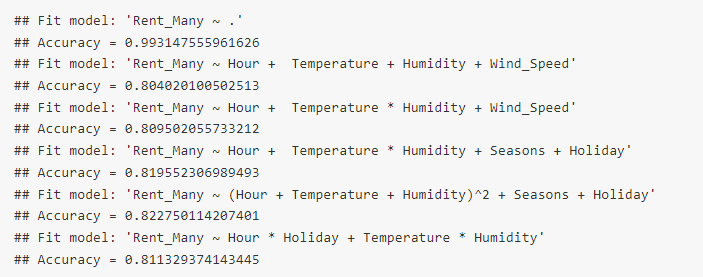

# Multiple Linear Regression (MLR) and Logistic Models

Fit and predict with multiple linear regression models and, similarly, with logistic regression models.

[Project report](https://rpubs.com/clh2021/1119982)

Key features:

- Exploratory Data Analysis (EDA)
- Numerical Summaries and Contingency Tables
- Correlation Analysis
- Test/Train Data Split
- Multiple Linear Regression (MLR)
- Logistic Regression

R packages used:

- `here`: enables easy file referencing and builds file paths in a OS-independent way
- `stats`: loads this before loading `tidyverse` to avoid masking some `tidyverse` functions
- `tidyverse`: includes collections of useful packages like `dplyr` (data manipulation), `tidyr` (tidying data),  `ggplots` (creating graphs), etc.
- `glue`: embeds and evaluates R expressions into strings to be printed as messages
- `scales`: formats and labels scales nicely for better visualization
- `GGally`: extends 'ggplot2' by combining geometric objects with transformed data
- `corrplot`: Provides a visual exploratory tool on correlation matrix that supports automatic variable reordering to help detect hidden patterns among variables.
- `Hmisc`: Contains many functions useful for data analysis, high-level graphics, utility operations, functions for computing sample size and power, simulation
- `ggmosaic`: create visualizations of categorical data and is capable of producing bar charts, stacked bar charts, mosaic plots, and double decker plots.
- `caret`: training and plotting classification and regression models
- `broom`: tidy and unify the fit objects returned by most of the modeling functions
- `modelr`:Functions for modelling that help you seamlessly integrate modelling into a pipeline of data manipulation and visualisation.

## Project Report

[Project report](https://rpubs.com/clh2021/1119982) ([Github Markdown](./MLR_logistic.md))([R Markdown](./MLR_logistic.Rmd))

The analysis results with all theoretical backgrounds and math derivations are included. 

Chien-Lan Hsueh (chienlan.hsueh at gmail.com)

## Overview and Project Goal

We conduct an exploratory data analysis (EDA) on the [Seoul Bike Sharing Demand](https://archive.ics.uci.edu/dataset/560/seoul+bike+sharing+demand) dataset. Then we fit  multiple linear regression models and with logistic regression models to make predictions on the two response variables: numeric `Rent_Count` and its re-coded variable `Rent_Many`. Model performances are then compared using accuracy metric.

## Workflow

1. Data
   - Prep and Tidying
   - Split Test/Train Data
1. EDA
   - Response variable (numeric `Rent_Count` and its re-coded variable `Rent_Many`)
   - Categorical Predictors
   - Numeric Predictors
1. MLR Models
1. Logistic Regression Models
1. Conclusion

